# Artificial Intelligence for Trading Nanodegree

## Alpha Research and Factor Modelling

## Project: Multi-Factor Model

## Table of Contents

1. [Project Overview](#overview)
2. [Data](#data)
3. [Statistical Risk Model](#stat_risk_model)
4. [Alpha Factors](#alpha_factors)
   1. [Momentum 1 Year Factor](#momentum)
   2. [Mean Reversion 5 Day Sector Neutral Factor](#mean_reversion)
   3. [Mean Reversion 5 Day Sector Neutral Smoothed Factor](#mean_reversion_smoothed)
   4. [Overnight Sentiment Factor](#overnight)
   5. [Overnight Sentiment Factor Smoothed](#overnight_smoothed)
5. [The Combined Alpha Factor](#alpha_combined)
6. [Evaluate Alpha Factors](#eval)
7. [Optimal Portfolio Constrained by Risk Model](#optimize)
    1. [Objective and Constraints](#objective_constraints)
    2. [Optimize with a Regularization Parameter](#optimization)
    3. [Optimize with a Strict Factor Constraints and Target Weighting](#strict_optimization)
8. [Libraries](#lib)
9. [References](#refs)

<a id='overview'></a>

***

### Project Overview

In this project, I will build a [statistical risk model using PCA](#stat_risk_model). I’ll use this model to build a portfolio along with **5 alpha factors**. I’ll **create** these factors, then **evaluate** them using **factor-weighted returns, quantile analysis, sharpe ratio,** and **turnover analysis.** At the end of the project, I’ll optimize the portfolio using the risk model and factors using multiple optimization formulations.

<a id='data'></a>

### Data

For the dataset, we'll be using the end of day from [Quotemedia](https://www.quotemedia.com) and sector data from [Sharadar](http://www.sharadar.com/).

Udacity doesn't have a license to redistribute the data to us. They are working on alternatives to this [problem](https://github.com/udacity/artificial-intelligence-for-trading/#no-data).

<a id='stat_risk_model'></a>

### Statistical Risk Model

Portfolio risk is calculated using this formula:

<center>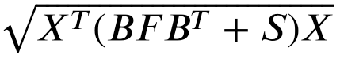</center>

where:

- *X* is the portfolio weights (weights assigned to each stock)
- *B* is the factor betas (exposure of factors)
- *F* is the factor covariance matrix (combined with factor betas gives systematic risk)
- *S* is the idiosyncratic variance matrix (specific risk)

<a id='alpha_factors'></a>

### Alpha Factors

After calculating the profile risk, the following five alpha factors were created:

<a id='momentum'></a>

- Momentum 1 Year Factor <sup>[[2]](#ref2)</sup>

Each factor has a hypothesis that goes with it. For this factor, it is "Higher past 12-month (252 days) returns are proportional to future return". Using that hypothesis, we've generate this code:

```python
from zipline.pipeline.factors import Returns

def momentum_1yr(window_length, universe, sector):
    return Returns(window_length=window_length, mask=universe) \
        .demean(groupby=sector) \
        .rank() \
        .zscore()
```

<a id='mean_reversion'></a>

- Mean Reversion 5 Day Sector Neutral Factor <sup>[[1]](#ref1)</sup>

I have implemented `mean_reversion_5day_sector_neutral` using the hypothesis "Short-term outperformers (underperformers) compared to their sector will revert." Using the returns data from universe, demean using the sector data to partition, rank, then converted to a zscore.

```python
def mean_reversion_5day_sector_neutral(window_length, universe, sector):
    """
    Generate the mean reversion 5 day sector neutral factor

    Parameters
    ----------
    window_length : int
        Returns window length
    universe : Zipline Filter
        Universe of stocks filter
    sector : Zipline Classifier
        Sector classifier

    Returns
    -------
    factor : Zipline Factor
        Mean reversion 5 day sector neutral factor
    """
    
    return -Returns(window_length=window_length, mask = universe)\
                    .demean(groupby=sector)\
                    .rank()\
                    .zscore()
```

<a id='mean_reversion_smoothed'></a>

- Mean Reversion 5 Day Sector Neutral Smoothed Factor

Taking the output of the previous factor, we create a smoothed version. `mean_reversion_5day_sector_neutral_smoothed` generates a mean reversion 5 day sector neutral smoothed factor. Calling the mean_reversion_5day_sector_neutral function to get the unsmoothed factor, then using `SimpleMovingAverage` function to smooth it. We'll have to apply rank and zscore again.

```python
from zipline.pipeline.factors import SimpleMovingAverage

def mean_reversion_5day_sector_neutral_smoothed(window_length, universe, sector):
    """
    Generate the mean reversion 5 day sector neutral smoothed factor

    Parameters
    ----------
    window_length : int
        Returns window length
    universe : Zipline Filter
        Universe of stocks filter
    sector : Zipline Classifier
        Sector classifier

    Returns
    -------
    factor : Zipline Factor
        Mean reversion 5 day sector neutral smoothed factor
    """
    
    mean_reversion = mean_reversion_5day_sector_neutral(window_length, universe, sector)

    return SimpleMovingAverage(inputs=[mean_reversion], window_length = window_length).rank().zscore()
```

<a id='overnight'></a>

- Overnight Sentiment Factor <sup>[[1]](#ref1)</sup>

For this factor, were using the hypothesis from the paper [Overnight Returns and Firm-Specific Investor Sentiment](https://papers.ssrn.com/sol3/papers.cfm?abstract_id=2554010).

```python
from zipline.pipeline.data import USEquityPricing


class CTO(Returns):
    """
    Computes the overnight return, per hypothesis from
    https://papers.ssrn.com/sol3/papers.cfm?abstract_id=2554010
    """
    inputs = [USEquityPricing.open, USEquityPricing.close]

    def compute(self, today, assets, out, opens, closes):
        """
        The opens and closes matrix is 2 rows x N assets, with the most recent at the bottom.
        As such, opens[-1] is the most recent open, and closes[0] is the earlier close
        """
        out[:] = (opens[-1] - closes[0]) / closes[0]

class TrailingOvernightReturns(Returns):
    """
    Sum of trailing 1m O/N returns
    """
    window_safe = True

    def compute(self, today, asset_ids, out, cto):
        out[:] = np.nansum(cto, axis=0)


def overnight_sentiment(cto_window_length, trail_overnight_returns_window_length, universe):
    cto_out = CTO(mask=universe, window_length=cto_window_length)
    return TrailingOvernightReturns(
         inputs=[cto_out],window_length=trail_overnight_returns_window_length
         )\
         .rank().zscore()
```

<a id='overnight_smoothed'></a>

- Overnight Sentiment Smoothed

Just like the implemented factor, we'll also smooth this factor.

```python
def overnight_sentiment_smoothed(cto_window_length, trail_overnight_returns_window_length, universe):

    unsmoothed_factor = overnight_sentiment(cto_window_length, trail_overnight_returns_window_length, universe)
    
    return SimpleMovingAverage(
            inputs=[unsmoothed_factor], window_length=trail_overnight_returns_window_length
            ) \
            .rank() \
            .zscore()
```

<a id='alpha_combined'></a>

### Combined Alpha Factor

With all the factor implementations done, let's add them to a _zipline_ pipeline.

```python
universe = AverageDollarVolume(window_length=120).top(500)
sector = project_helper.Sector()

pipeline = Pipeline(screen=universe)
pipeline.add(
    momentum_1yr(252, universe, sector),
    'Momentum_1YR')
pipeline.add(
    mean_reversion_5day_sector_neutral(5, universe, sector),
    'Mean_Reversion_5Day_Sector_Neutral')
pipeline.add(
    mean_reversion_5day_sector_neutral_smoothed(5, universe, sector),
    'Mean_Reversion_5Day_Sector_Neutral_Smoothed')
pipeline.add(
    overnight_sentiment(2, 5, universe),
    'Overnight_Sentiment')
pipeline.add(
    overnight_sentiment_smoothed(2, 5, universe),
    'Overnight_Sentiment_Smoothed')
all_factors = engine.run_pipeline(pipeline, factor_start_date, universe_end_date)
# all_factors.head()
```

<a id='eval'></a>

### Evaluate Alpha Factors

*Note:* _We're evaluating the alpha factors using delay of 1_

#### Quantile Analysis

Let's view the factor returns over time. It looks like moving up and to the right.

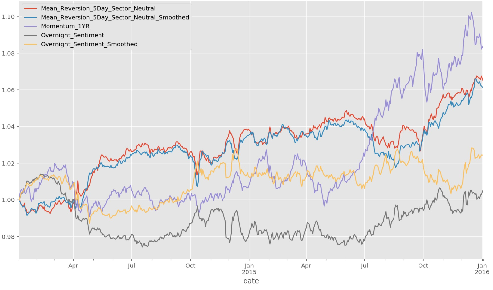

It is not enough to look just at the factor weighted return. A good alpha is also monotonic in quantiles. Let's looks the basis points for the factor returns.

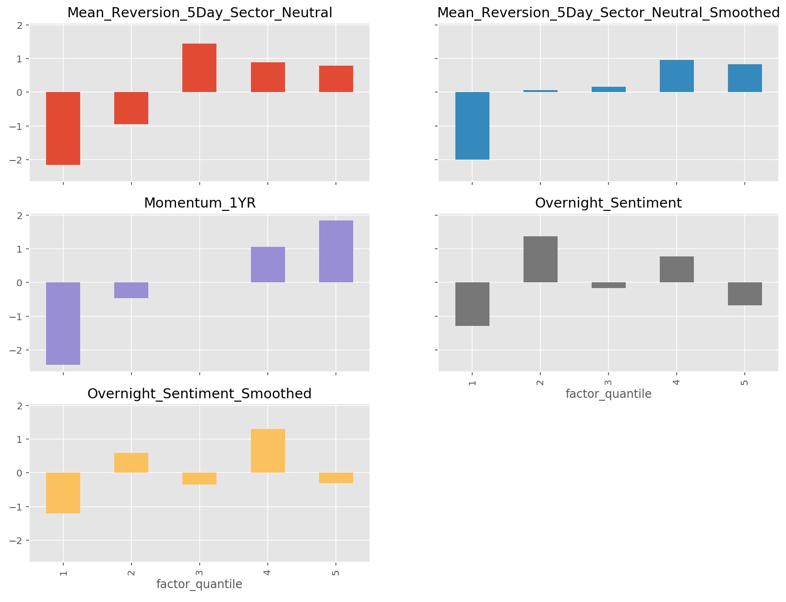

Observations:

- None of these alphas are **strictly monotonic**; this should lead you to question why this is? Further research and refinement of the alphas needs to be done. What is it about these alphas that leads to the highest ranking stocks in all alphas except MR 5D smoothed to *not* perform the best.
- The majority of the return is coming from the **short side** in all these alphas. The negative return in quintile 1 is very large in all alphas. This could also a cause for concern becuase when you short stocks, you need to locate the short; shorts can be expensive or not available at all.
- If you look at the magnitude of the return spread (i.e., Q1 minus Q5), we are working with daily returns in the 0.03%, i.e., **3 basis points**, neighborhood *before all transaction costs, shorting costs, etc.*. Assuming 252 days in a year, that's 7.56% return annualized. Transaction costs may cut this in half. As such, it should be clear that these alphas can only survive in an institutional setting and that leverage will likely need to be applied in order to achieve an attractive return.

#### Turnover Analysis

Without doing a full and formal backtest, we can analyze how stable the alphas are over time. Stability in this sense means that from period to period, the alpha ranks do not change much. Since trading is costly, we always prefer, all other things being equal, that the ranks do not change significantly per period. We can measure this with the **factor rank autocorrelation (FRA)**.

<a id='fra'></a>

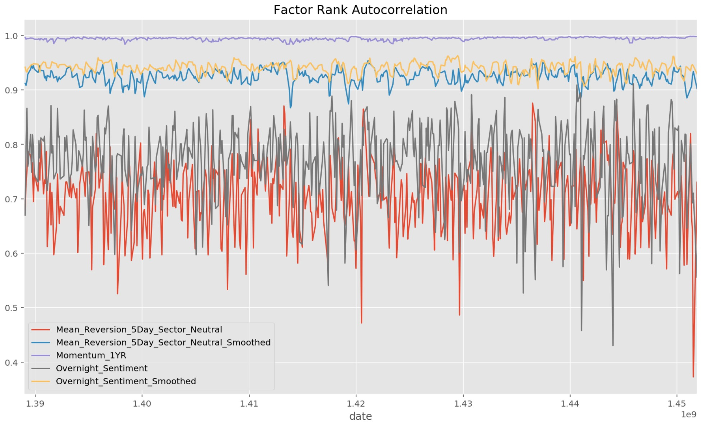

#### Sharpe Ratio of the Alphas

The last analysis we'll do on the factors will be sharpe ratio. Function `sharpe_ratio` calculate the sharpe ratio of factor returns.

```python
def sharpe_ratio(factor_returns, annualization_factor):
    """
    Get the sharpe ratio for each factor for the entire period

    Parameters
    ----------
    factor_returns : DataFrame
        Factor returns for each factor and date
    annualization_factor: float
        Annualization Factor

    Returns
    -------
    sharpe_ratio : Pandas Series of floats
        Sharpe ratio
    """

    return annualization_factor * np.mean(factor_returns)/np.std(factor_returns, ddof=1)
```

Let's see what the sharpe ratio for the factors are. Generally, a Sharpe Ratio of near 1.0 or higher is an acceptable single alpha for this universe.

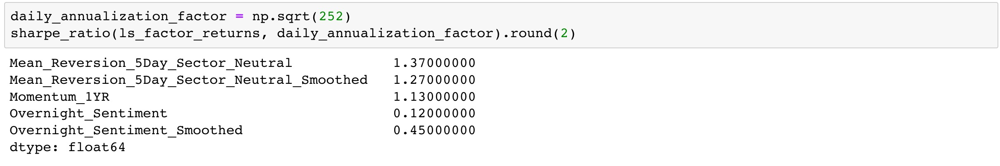

Observation:

Sharpe Ratio of 1.13 for momentum factor is good but if we look at the [auto-correlation plots](#fra), FRA for momentum factor looks stable. So smoothing the momentum factor will not have any significant change.

#### The Combined Alpha Vector

To use these alphas in a portfolio, we need to combine them somehow so we get a single score per stock. This is a area where machine learning can be very helpful. In this module, however, we will take the simplest approach of combination: simply averaging the scores from each alpha.

<a id='optimize'></a>

### Optimal Portfolio Constrained by Risk Model

<a id='objective_constraints'></a>

#### Objective and Constraints

This is the list of contraints that will optimize against:

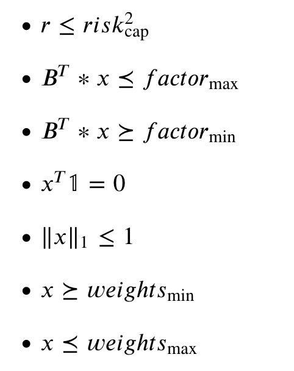

Where _x_ is the portfolio weights, _B_ is the factor betas, and _r_ is the portfolio risk

The first constraint is that the predicted risk be less than some maximum limit. The second and third constraints are on the maximum and minimum portfolio factor exposures. The fourth constraint is the "market neutral constraint: the sum of the weights must be zero. The fifth constraint is the leverage constraint: the sum of the absolute value of the weights must be less than or equal to 1.0. The last are some minimum and maximum limits on individual holdings.

Weights generated after applying those constraints:

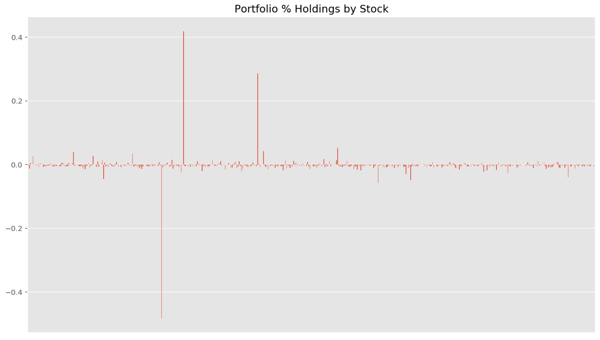

Yikes. It put most of the weight in a few stocks.

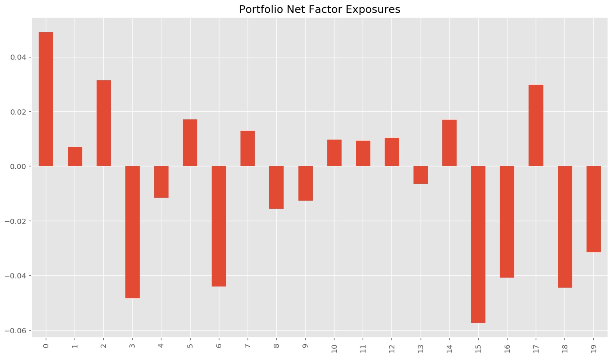

<a id='optimization'></a>

#### Optimize with a Regularization Parameter

This is the weights distribution after applying regularization to the **objective function**.

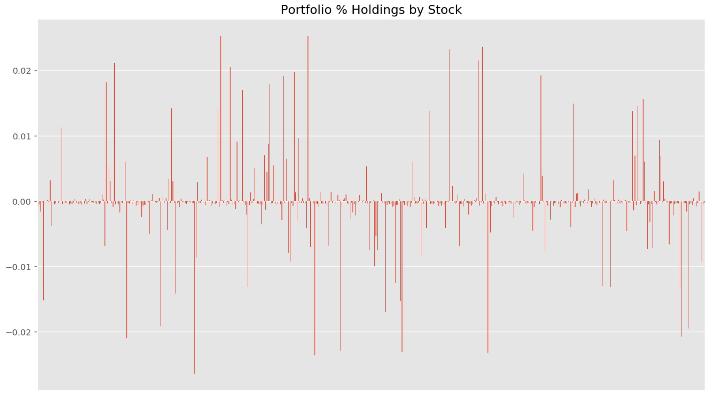

Nice. Well diverfied.

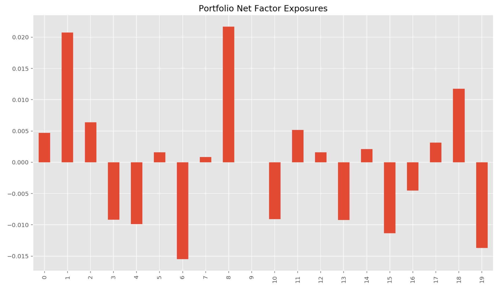

<a id='strict_optimization'></a>

#### Optimize with a Strict Factor Constraints and Target Weighting

Another common formulation is to take a predefined target weighting(e.g., a quantile portfolio), and solve to get as close to that portfolio while respecting portfolio-level constraints.

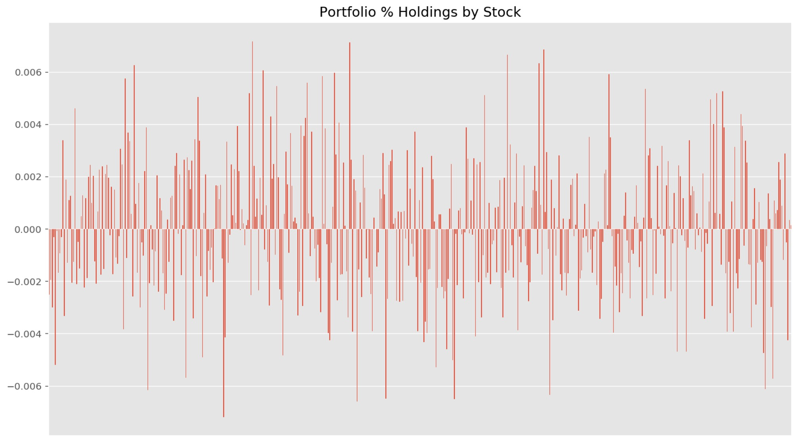

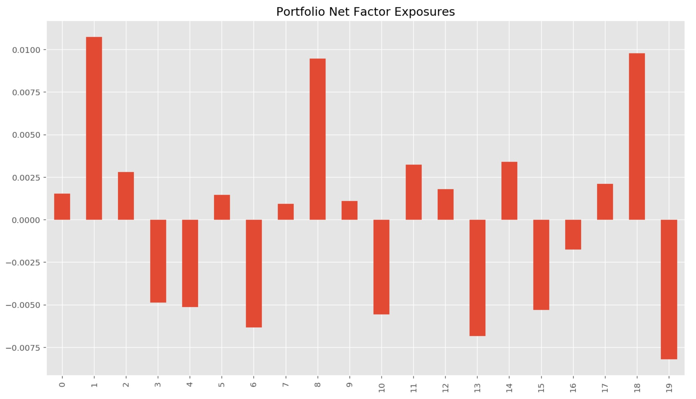

<a id='lib'></a>

### Libraries

This project used Python 3.6.3. The necessary libraries are mentioned in `requirements.txt`:

<a id='refs'></a>

### References

<a id='ref1'></a>

1. [Overnight Returns and Firm-Specific Investor Sentiment](https://papers.ssrn.com/sol3/papers.cfm?abstract_id=2554010)

<a id='ref2'></a>

2. [The Formation Process of Winners and Losers in Momentum Investing](https://papers.ssrn.com/sol3/papers.cfm?abstract_id=2610571)

3. [Expected Skewness and Momentum](https://papers.ssrn.com/sol3/papers.cfm?abstract_id=2600014)

4. [Arbitrage Asymmetry and the Idiosyncratic Volatility Puzzle](https://papers.ssrn.com/sol3/papers.cfm?abstract_id=2155491)
